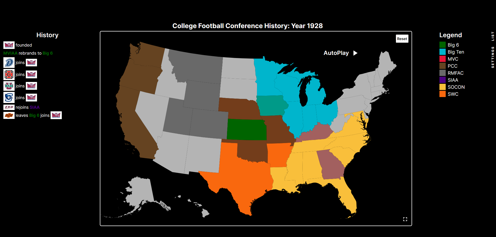
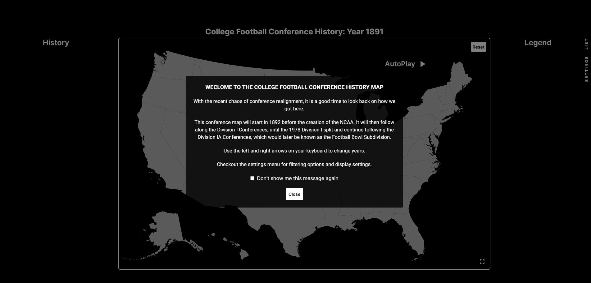

# CFB Conference Map

## Description

This map traces the evolution of Football Bowl Series (FBS) conferences, beginning before the formation of the Intercollegiate Athletic Association of the United States (IAAUS) on March 31, 1906, which later became known as the National Collegiate Athletic Association (NCAA). While only two conferences were operational before this date, it is essential to acknowledge the inaugural college football conference, the Western Interstate University Football Association (WIUFA), and the Southern Intercollegiate Athletic Association (SIAA), which would emerge as a prominent conference under the NCAA.

At the time of the NCAA's establishment, college football lacked divisions, and only a few conferences existed. Most teams competed as independents. While this map does not track independent schools, it will highlight instances where schools left conferences to become independent. The timeline then follows the Division I college football landscape, beginning in 1973 after the NCAA divided college football into three divisions (Division I, II, and III). Subsequently, the map focuses on all Division I-A conferences, now recognized as FBS, following the subdivision that occurred in 1978.

## Website

This project has a working website and can be viewed here: [College Football Conference Map](https://college-football-conference-map.netlify.app)

## Screenshots

### Map

### Welcome

## Technologies Used

- **Frontend Framework:** Next.js
- **CSS Framework:** Tailwind CSS
- **Data Visualization:** React Simple Maps
- **Data Structure:** JSON

## License

This project is licensed under All Rights Reserved. For more details, please refer to the license.txt file.

## Contact Information

- **Name:** Anthony Morton
- **Email:** anthonymorton760@gmail.com
- **LinkedIn:** [Connect with Me on LinkedIn](www.linkedin.com/in/anthony-louis-morton/)
